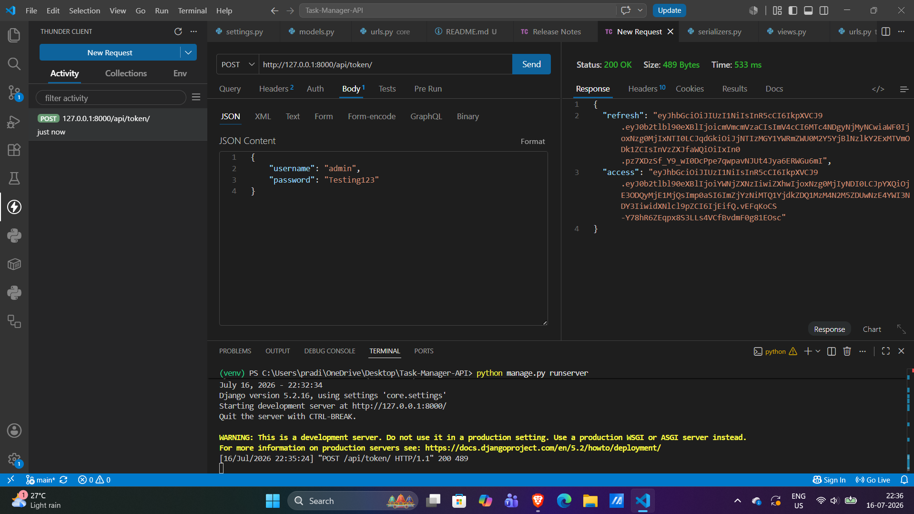
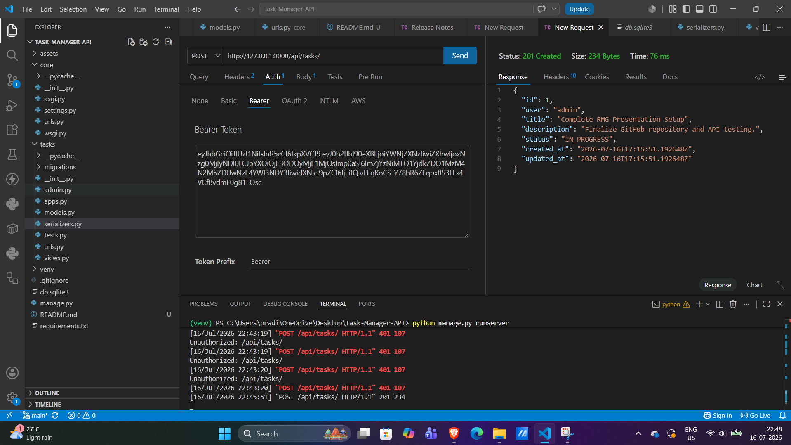
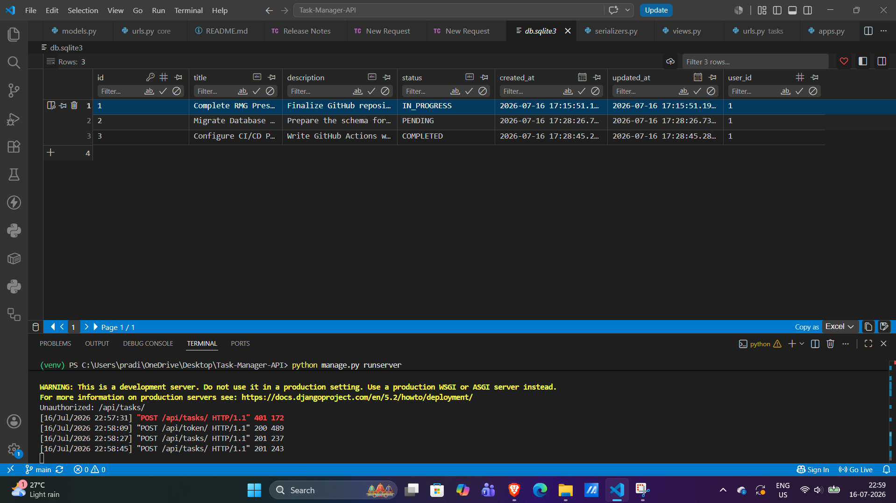

# Enterprise Task Management API 📋🔒

A secure, full-stack REST API built to demonstrate backend architectural mastery, relational database management, and stateless authentication. 

This microservice provides isolated Task Management (CRUD) capabilities where users can seamlessly manage their data with strict tenant isolation enforced by JSON Web Tokens (JWT).

## 🧠 System Architecture & Tech Stack
* **Backend Framework:** Django & Django REST Framework (DRF)
* **Authentication:** Stateless JSON Web Tokens (SimpleJWT)
* **Database:** SQLite (Relational structure with Foreign Key cascades)
* **View Controllers:** DRF `ModelViewSet` for optimized, DRY routing
* **Security:** Tenant Isolation (Users can only read/mutate their own database rows)

## 🗄️ Database Schema (Entity Relationship)
The application relies on a strictly normalized relational database.
* `User` (Django Auth Model) 
  * `1:N` Relationship with `Task`
* `Task` Model:
  * `id` (Primary Key)
  * `user_id` (Foreign Key -> CASCADE)
  * `title` (Char)
  * `description` (Text)
  * `status` (PENDING, IN_PROGRESS, COMPLETED)
  * `created_at` / `updated_at` (Timestamps)

## 🛣️ Core API Endpoints

### Authentication (Public)
* `POST /api/token/` - Submit credentials to receive Access & Refresh JWTs.
* `POST /api/token/refresh/` - Submit a valid refresh token to obtain a new access token.

### Task Management (Secure - Requires Bearer Token)
* `GET /api/tasks/` - Retrieve all tasks belonging to the authenticated user.
* `POST /api/tasks/` - Create a new task (automatically binds to the active user ID).
* `GET /api/tasks/<id>/` - Retrieve a specific task payload.
* `PUT /api/tasks/<id>/` - Update an entire task record.
* `DELETE /api/tasks/<id>/` - Permanently delete a task.

## 📸 Visual Execution Proof

### 1. Stateless Authentication (JWT Generation)
*Successfully generating an encrypted access token from user credentials.*

### 2. Secure API Routing (Task Creation)
*Successfully passing the Bearer token to create a task tied to the active user.*

### 3. Relational Database State
*Raw SQLite view demonstrating data persistence and foreign key assignment.*
